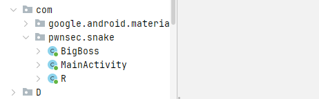
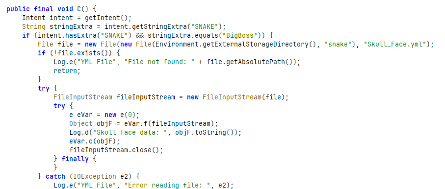
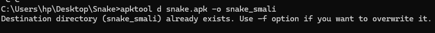
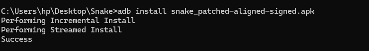
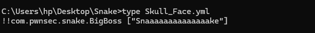

# LAB 19 : Snake — PwnSec CTF 2024 Mobile Hard

## Objectif
Exploiter une vulnérabilité de désérialisation SnakeYAML (CVE-2022-1471) dans une application Android protégée par des mécanismes anti-reverse (détection root, émulateur, Frida).

---

## Outils utilisés
---

## Étape 1 — Analyse statique avec Jadx

### Structure du package

Le package `com.pwnsec.snake` contient deux classes importantes : `MainActivity` (classe principale avec les protections) et `BigBoss` (classe cible de l'exploitation).

### Analyse de MainActivity

Points clés découverts : vérification de l'Intent `SNAKE=BigBoss`, lecture du fichier `/sdcard/snake/Skull_Face.yml`, parsing avec SnakeYAML vulnérable CVE-2022-1471, et détections de root, émulateur et Frida.

### Analyse de BigBoss

La classe BigBoss charge une librairie native et contient un constructeur qui vérifie si le paramètre reçu est `Snaaaaaaaaaaaaaake`. Si oui, elle appelle une fonction native qui génère le flag et l'affiche dans les logs.

---

## Étape 2 — Décompilation avec apktool

L'APK est décompilé en fichiers Smali pour permettre le patching des méthodes de détection.

---

## Étape 3 — Patch Smali

Toutes les méthodes de détection sont patchées pour retourner `false` : `isDeviceRooted()`, `checkForDangerousBinaries()`, `checkForRootManagementApps()`, `checkForRootShell()` et `checkForWritableSystem()`.

---

## Étape 4 — Recompilation et signature

L'APK patché est recompilé, signé avec uber-apk-signer et installé sur l'émulateur via ADB.

---

## Étape 5 — Payload YAML (CVE-2022-1471)

Le payload `!!com.pwnsec.snake.BigBoss ["Snaaaaaaaaaaaaaake"]` exploite la désérialisation unsafe de SnakeYAML 1.33. Le tag `!!` force l'instanciation directe de la classe Java `BigBoss` avec le paramètre `Snaaaaaaaaaaaaaake`.

---

## Étape 6 — Lancement avec Intent

L'application est lancée via ADB avec l'extra Intent `SNAKE=BigBoss`. Cela déclenche la lecture du fichier YAML, la désérialisation, l'instanciation de BigBoss et l'appel à la fonction native.

---

## Étape 7 — Récupération du flag

Le flag est récupéré via logcat en filtrant sur le tag `BigBoss`.

---

  %%%PWNSEC{W3'r3_N0t_T00l5_0f_The_g0v3rnm3n7_0R_4ny0n3_3ls3}%%%
